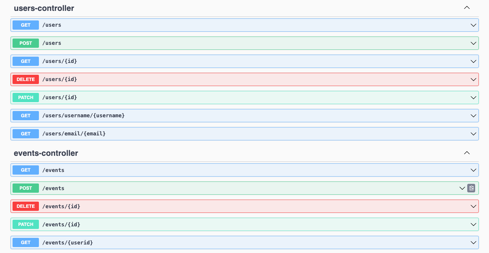

# Weather Calender

### Project Description
This project was part of TU Berlin Summer School 2023 course, Modern Cloud Project with Java. The course tasked us to work in groups to create a web application that
1. makes use of a database
2. has a web UI
3. supports multiple users with logins
4. uses publicly available data 
5. calculates additional data or provides a visualisation, providing the user with additional value

Given this prompt, my group and I ideated a web application that allows users to visualise the weather together with their planned events on a calender This would allow users to better plan their days according to the weather. 
To do so, we make use of an API by visual crossing which provides up to 15-day weather forecasts for a wide variety of locations. 
Users are also able to create profiles to which their created events and default locations will be saved and can be viewed when they log in. Basic functionalities such as creating, editing and deleting profiles and events are also implemented for users.

## Technical Specifications:
This is a **Springboot** project, using **Java and Maven**. We make use of **JPA** to conduct ORM to allow our **REST API controllers and models** to map to the **relational database hosted with a PostgreSQL** image. 
We access an external [Weather API](https://www.visualcrossing.com/weather-api) to get the weather forecast to display. For the frontend, we made use of **Javascript with HTML and Bootstrap** for a cleaner and intuitive user interface.
For the calender view, we make use of existing [Full Calender Package](https://fullcalendar.io/demos). The application is also containerised with Docker to allow for consistent deployment. 
We also hosted the application on Google Cloud Platform for a while for learning purposes. 

### Project Break-down
#### Backend
`WeatherCalenderTest/src/main/java/com.example.WeatherCalenderTest` contains all the relevant Backend functions, featuring JPA Object Relational Mapping models with REST API controllers to communicate with the PostgreSQL docker container. The 2 
tables required by the project is one for user profile data, and another for all calender events. There is a one-to-many mapping relationship between user and events.
<ul>
<li><code> /controller</code>: EventsController and UsersController contain the REST API mappings and functions to the PostgreSQL tables. 
</li>
<li><code> /model</code>: WeatherEvent and WeatherUser are used to describe schema for each table in the database, clearly stating the datatypes and column names </li>
<li><code> /resources</code>: EventInput and UserInput manage the creation and editing of the events and user data. EventsRepository and UserRepository define the tables based on JPArespository and the models defined earlier </li>
</ul>

#### Frontend

`WeatherCalenderTest/src/main/resources/static` contains all the Frontend code. 
<ul>
<li><code>index.html </code> describes the User Interface elements such as modals and navbar with user friendly simple design.</li>
<li><code>ExternalAPI.js </code> is the support code that handles the calling of the WeatherAPI to attain and format the relevant data.</li>
<li><code>Login.js </code> calls on the relevant REST API functions to the backend to handle session log in and sign up data. </li>
<li><code>Calender.js </code> handles the updating of the calender visual with weather and user events as well as managing events in the backend through the REST API.</li>
</ul>
 

## How to run the project
### Docker
Ensure your docker daemon is running.\
Create and start docker containers based on *docker-compose.yml* file using

    docker compose up --detach

To shutdown docker containers use

    docker compose down --volumes

### Java application
Build and Run WeatherCalenderTestApplication Java project in IntelliJ. Access index.html at localhost:8080 to see the webpage.

    http://localhost:8080/index.html

### Project REST API endpoints
To test and understand the REST API 

    http://localhost:8080/swagger-ui.html

### Reference Documentation
For further reference, please consider the following sections:

* [Official Apache Maven documentation](https://maven.apache.org/guides/index.html)
* [Spring Boot Maven Plugin Reference Guide](https://docs.spring.io/spring-boot/docs/3.1.1/maven-plugin/reference/html/)
* [Weather API](https://www.visualcrossing.com/weather-api)

